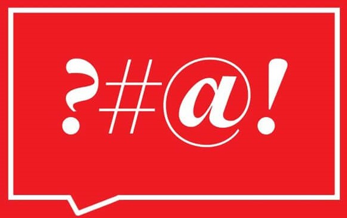

<p align="center" >
    <a>
        
    </a>
</p>

# Curse-IO

[![][build-img]][build]
[![][nuget-img]][nuget]

Package to cleanse strings from curse words

Install in Nuget CLI:
`Install-Package Curse-IO -Version 1.0.0`


[build]:     https://ci.appveyor.com/project/VitorCioletti/curse-io
[build-img]: https://ci.appveyor.com/api/projects/status/nv34gc8sm0ds2cxj?svg=true
[nuget]:     https://www.nuget.org/packages/Curse-IO/
[nuget-img]: https://badge.fury.io/nu/curse-io.svg

[CurseWordRepository]: https://github.com/LDNOOBW/List-of-Dirty-Naughty-Obscene-and-Otherwise-Bad-Words

* [Basic usage](#basic-usage)
* [Setting a language dictionary](#setting-a-language-dictionary)
* [Getting the current language](#getting-the-current-language)
* [Get all cleansed bad words](#get-all-cleansed-bad-words)
* [Asynchronous cleaning](#asynchronous-cleaning)
* [Setting new curse char](#setting-new-curse-char) 
* [Adding words to current dictionary](#adding-words-to-current-dictionary)
* [Removing words from current dictionary](#removing-words-to-current-dictionary)
* [Supported languages](#supported-languages)


## Basic Usage
The package provides some basic curse word list to cleanse strings.

```cs
var text = "The quick brown fox jumps over the foo dog";

var curse = new Curse();

// The quick brown fox jumps over the *** dog;
var cleansedText = curse.Cleanse(text);

```

## Setting a language dictionary

It is possible to set a specific language to cleanse your string. The default one is `English`
```cs
var curse = new Curse();

curse.SetLanguage(Language.French);

```

or this

```cs
var curse = new Curse(Language.French);
```

## Getting the current language

It is also possible to get a the current language.
```cs
var curse = new Curse();

var language = curse.GetCurrentLanguage();

```

## Get all cleansed bad words
`Cleanse(string, IDicionary<string,int>)` returns a dictionary where key is the bad word and the value is the amount of times it appeared in the given string.

```cs
var text = "The quick brown fox jumps over the foo dog";

var curse = new Curse();
IDictionary<string, int> replacedWords;

curse.Cleanse(text, out replacedWords);

```

## Asynchronous cleansing


```cs
var text = "The quick brown fox jumps over the foo dog";

var curse = new Curse();

var cleansedText = await curse.CleanseAsync(text);

```

## Setting new curse char
You can add a new curse char to replace the default one: `*`

```cs
var text = "The quick brown fox jumps over the foo dog";

var curse = new Curse();

curse.SetCurseChar('?');

// The quick brown fox jumps over the ??? dog;
var cleansedText = curse.Cleanse(text);

```


## Adding words to current dictionary
```cs
var text = "The quick foo fox jumps bar the bar dog";

var curse = new Curse();

var newCurseWords = new List<string>() {"foo", "bar"};
curse.AddNewWords(newCurseWords);

// The quick *** fox jumps *** the *** dog
var cleansedText = curse.Cleanse(text);

```

You can also add only one word
```cs
var curse = new Curse();

curse.AddNewWord("Foo");
```

## Removing words from current dictionary
```cs
var text = "The quick foo fox jumps the bar dog";

var curse = new Curse();

var removeWords = new List<string>() {"foo", "bar"};
curse.RemoveWords(removeWords);

// The quick foo fox jumps the bar dog
var cleansedText = curse.Cleanse(text);

```

You can also remove only one word.
```cs
var curse = new Curse();

curse.RemoveWord("idiot");
```

## Supported languages

The word lists were got from [this repository][CurseWordRepository].

- English
- French
- Spanish
- German
- Italian


<p align="center">
    <a href="http://creativecommons.org/licenses/by/4.0/">
        
    </a>
</p>
<p align="center">Creative Commons 4.0 International</p>
